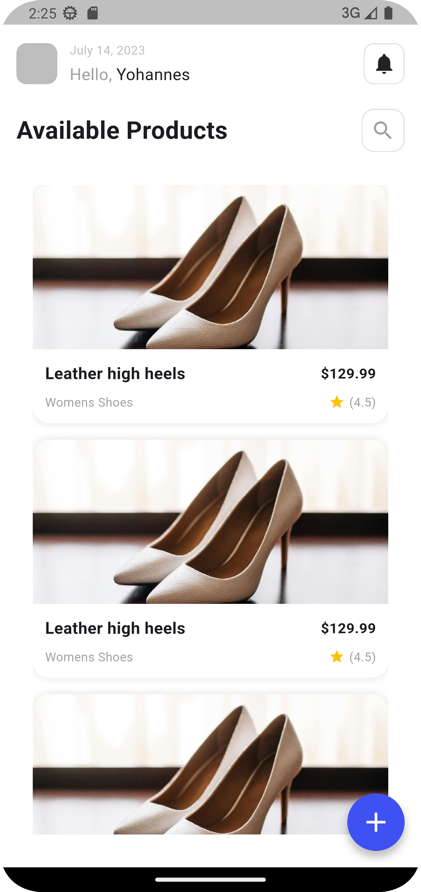
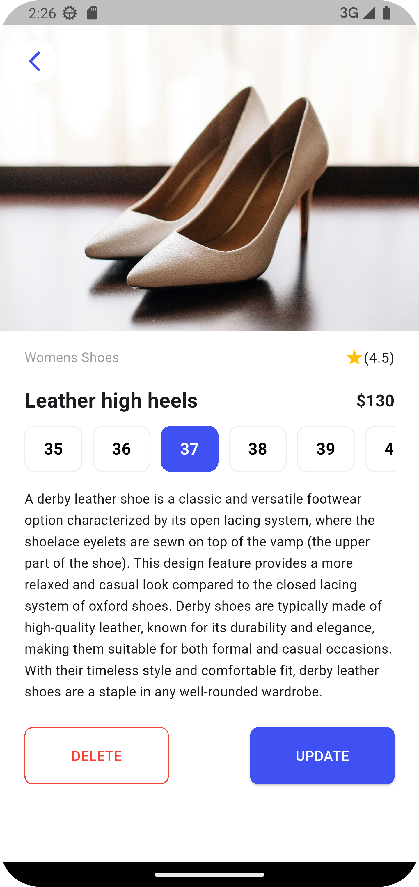
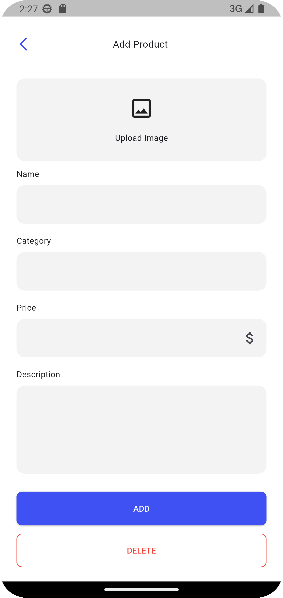
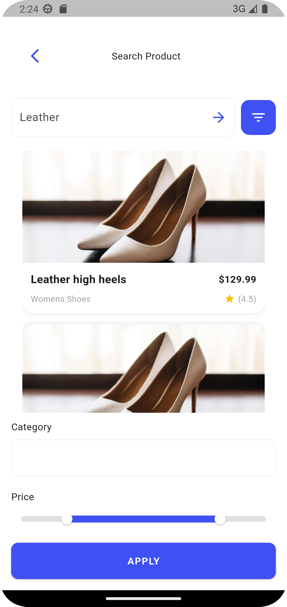

```markdown
# Flutter Ecommerce App

This project is a modular Flutter ecommerce app built using Clean Architecture principles. It separates concerns into data, domain, and presentation layers, making the app easier to test, scale, and maintain.

## Project Structure

lib/
├── core/ Shared utilities and constants
├── features/
│ └── product/
│ ├── data/ Models and repository implementations
│ │ └── models/
│ │ └── product_model.dart
│ ├── domain/ Business logic and entities
│ │ └── entities/
│ │ └── product.dart
│ ├── presentation/ UI screens and widgets

test/
└── features/
└── product/
└── data/
└── models/
└── product_model_test.dart
```

```

## Clean Architecture Layers

- **Data Layer**: Contains `ProductModel`, which handles JSON parsing (`fromJson`, `toJson`). It also includes implementations of repositories that fetch data from external sources.
- **Domain Layer**: Contains abstract repositories, use cases, and entities like `Product`. It is independent of any framework or platform.
- **Presentation Layer**: Contains UI screens and widgets. These layers interact with the domain layer to display data.
- **Core Layer**: Contains shared components such as constants and error handlers used across the app.

## Data Flow

1. JSON is fetched from an API or local source.
2. `ProductModel.fromJson()` converts it into a Dart object.
3. The domain layer uses the `Product` entity to handle business logic.
4. The presentation layer renders data through UI widgets and screens.

## Unit Testing

The test for `ProductModel` is located in:

```

test/features/product/data/models/product_model_test.dart

````

It tests:
- `fromJson` creates the correct model from a map.
- `toJson` returns the correct JSON map.

Run tests using:

```bash
flutter test
````

<h2>App Preview</h2>





